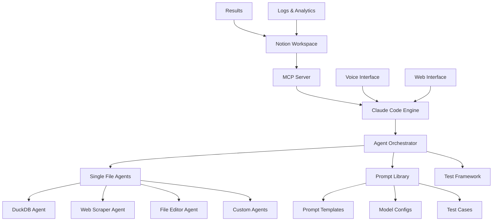

# Comprehensive Analysis of Disler's AI Engineering Repositories

## Executive Summary

This analysis covers 8 repositories from IndyDevDan (disler) that demonstrate cutting-edge AI engineering patterns, prompt engineering techniques, and agentic system architectures. These repositories collectively showcase a comprehensive approach to building powerful AI-driven tools with a focus on single-purpose agents, prompt engineering, testing, and programmable AI interfaces.

## Repository Summaries

### 1. **single-file-agents**
**Purpose**: A collection of powerful single-file AI agents built on top of UV (modern Python package manager)

**Key Capabilities**:
- Self-contained agents for specific tasks (DuckDB, SQLite, JQ, Polars CSV processing)
- Multi-provider support (OpenAI, Anthropic, Gemini)
- Web scraping with AI filtering
- Meta prompt generation
- Bash and file editing capabilities

**Architecture Patterns**:
- Single File Agent (SFA) pattern - one file, one purpose
- Embedded dependencies using UV
- Tool-use patterns with structured prompts
- Multiple architectural patterns demonstrated (atomic-composable, layered, pipeline, vertical-slice)

### 2. **reusable-openai-fine-tune**
**Purpose**: Streamlined framework for fine-tuning OpenAI models with custom datasets

**Key Capabilities**:
- Dataset upload and management
- Fine-tuning job orchestration
- Model training monitoring
- Custom model prompting
- Comprehensive decision framework for when to fine-tune vs prompt engineering

**Unique Features**:
- Example sarcastic factbot dataset
- Decision diagrams for fine-tuning vs prompt engineering
- Integration with OpenAI's fine-tuning API
- Cost optimization strategies

### 3. **marimo-prompt-library**
**Purpose**: Reactive notebook system for building and managing reusable prompt libraries

**Key Capabilities**:
- Interactive prompt testing across multiple LLMs
- Prompt versioning and management
- Multi-model comparison and ranking
- Reactive UI with real-time updates
- Integration with Ollama for local models

**Advantages**:
- Pure Python scripts (not JSON notebooks)
- Git-friendly version control
- Reactive execution model
- Built-in interactive elements

### 4. **llm-prompt-testing-quick-start**
**Purpose**: LLM evaluation and testing framework using Promptfoo

**Key Capabilities**:
- Multi-model benchmarking
- Assertion-based testing
- Cost and performance optimization
- Local model support via llamafile
- Comprehensive test organization

**Testing Patterns**:
- Provider comparison (GPT-3.5 vs Gemini Pro)
- Token optimization strategies
- JSON output validation
- Regression prevention

### 5. **infinite-agentic-loop**
**Purpose**: Experimental infinite agent orchestration system using Claude Code

**Key Capabilities**:
- Parallel agent deployment
- Progressive content generation
- Wave-based agent management
- Specification-driven development
- Custom Claude Code slash commands

**Innovation**:
- Multi-agent coordination
- Infinite generation patterns
- Quality assurance through iteration
- Progressive sophistication

### 6. **claude-code-is-programmable**
**Purpose**: Demonstrates programmable usage of Claude Code across different languages

**Key Capabilities**:
- CLI integration with Claude Code
- Voice-to-Claude-Code interface
- Multi-language examples (Python, JavaScript, Shell)
- MCP (Model Context Protocol) integration
- Notion API integration
- Web search capabilities

**Key Innovation**:
- Natural language tool orchestration
- Voice-enabled AI coding
- Integration with OpenAI Agent SDK

### 7. **claude-3-7-sonnet-starter-pack**
**Purpose**: Comprehensive examples showcasing Claude 3.7 Sonnet's capabilities

**Key Capabilities**:
- Extended thinking demonstrations
- Structured output generation
- Tool use examples
- MCP server integration
- Streaming responses
- Agent examples with bash and editor tools

**Unique Features**:
- Fine-grained intelligence control via thinking tokens
- Extended output (up to 128k tokens)
- Intelligence scaling guidelines

### 8. **anthropic-computer-use-bash-and-files**
**Purpose**: POC for Claude 3.5 Sonnet's computer use capabilities focused on terminal and file operations

**Key Capabilities**:
- Natural language terminal control
- File editing with multiple commands (view, create, str_replace, insert, undo)
- Session-based logging
- Cost tracking
- Safe mode for bash operations

**Architecture**:
- Tool-specific fine-tuning pattern
- Session management
- Comprehensive logging system

## YouTube Videos Found

1. **single-file-agents**: 
   - Walk-through: https://youtu.be/YAIJV48QlXc
   - Building agents with Devin/Cursor/Aider: https://youtu.be/vq-vTsbSSZ0

2. **marimo-prompt-library**:
   - Marimo reactive notebooks walkthrough: https://youtu.be/PcLkBkQujMI
   - Multi-model prompting walkthrough: https://youtu.be/VC6QCEXERpU

3. **llm-prompt-testing-quick-start**:
   - Last LLM Standing Wins: https://youtu.be/Cy1Z8J0anKw
   - Quick Start Tutorial: https://youtu.be/KhINc5XwhKs
   - Gemini Pro vs GPT-3.5 Turbo: https://youtu.be/V_SyO0t7TZY
   - Local LLMs: https://youtu.be/urymhRw86Fc

4. **infinite-agentic-loop**:
   - Tutorial: https://youtu.be/9ipM_vDwflI

5. **claude-code-is-programmable**:
   - Why this matters: https://youtu.be/2TIXl2rlA6Q
   - Voice to Claude Code: https://youtu.be/LvkZuY7rJOM

6. **claude-3-7-sonnet-starter-pack**:
   - Full breakdown: https://youtu.be/jCVO57fZIfM

7. **anthropic-computer-use-bash-and-files**:
   - Walk-through: https://youtu.be/FxwA0DLxyrw

## Key Patterns and Techniques

### 1. **Single File Agent (SFA) Pattern**
- Self-contained agents with embedded dependencies
- One file, one purpose philosophy
- UV package manager for dependency management
- Consistent CLI interface patterns

### 2. **Prompt Engineering Excellence**
- Structured prompt templates with clear sections (purpose, instructions, tools)
- Progressive prompt complexity
- Meta-prompt generation for creating new prompts
- Testing and validation frameworks

### 3. **Multi-Model Support**
- Provider abstraction patterns
- Consistent interfaces across OpenAI, Anthropic, and Gemini
- Model comparison and benchmarking
- Cost optimization strategies

### 4. **Tool Use Patterns**
- Fine-tuned tool integration
- Natural language tool orchestration
- Tool chaining and composition
- Context-aware tool execution

### 5. **Testing and Evaluation**
- Assertion-based testing with Promptfoo
- Multi-model benchmarking
- Token usage optimization
- Regression prevention

### 6. **Agent Orchestration**
- Parallel agent deployment
- Wave-based execution
- Progressive sophistication
- Quality assurance through iteration

### 7. **Developer Experience**
- Voice interfaces for AI coding
- Reactive notebooks for prompt development
- Session-based logging and monitoring
- Cost tracking and optimization

## Notion Integration Design

### Architecture Overview



### No-Code Notion Interface Design

#### 1. **Agent Command Center** (Notion Database)
```
Fields:
- Agent Name (Title)
- Agent Type (Select: Data Query, Web Scraping, File Operations, Custom)
- Provider (Multi-select: OpenAI, Anthropic, Gemini)
- Prompt Template (Long Text)
- Configuration (JSON)
- Last Run (Date)
- Status (Select: Ready, Running, Completed, Failed)
- Results (Rich Text)
- Cost Estimate (Number)
```

#### 2. **Prompt Library** (Notion Database)
```
Fields:
- Prompt Name (Title)
- Category (Select: Data Analysis, Content Generation, Code Generation, etc.)
- Template (Long Text)
- Variables (Multi-select)
- Tested Models (Relation to Models DB)
- Success Rate (Number)
- Average Tokens (Number)
- Examples (Rich Text)
```

#### 3. **Model Testing Dashboard** (Notion Database)
```
Fields:
- Test Name (Title)
- Prompt (Relation to Prompt Library)
- Models Tested (Multi-select)
- Assertions (Long Text)
- Results (Table/Gallery of model outputs)
- Winner (Select)
- Cost Comparison (Number)
- Performance Metrics (JSON)
```

#### 4. **Workflow Builder** (Notion Page Template)
```
Sections:
1. Workflow Overview
   - Name
   - Description
   - Trigger (Manual/Scheduled/Event)
   
2. Agent Pipeline (Synced Blocks)
   - Step 1: [Select Agent] → [Configure] → [Test]
   - Step 2: [Select Agent] → [Configure] → [Test]
   - ...
   
3. Data Flow
   - Input Sources (Notion DBs, External APIs)
   - Transformations
   - Output Destinations
   
4. Execution Log
   - Run History
   - Performance Metrics
   - Error Tracking
```

#### 5. **Voice Command Interface** (Notion Integration)
```
Components:
- Voice Command Templates (Database)
- Command History (Database)
- Quick Actions (Synced Blocks)
- Results Display (Embedded Views)
```

### Implementation Strategy

#### Phase 1: Foundation (Weeks 1-2)
1. Set up MCP server with Notion API integration
2. Create base Notion templates and databases
3. Implement single agent execution from Notion
4. Basic logging and result capture

#### Phase 2: Agent Integration (Weeks 3-4)
1. Port key SFA agents to Notion-callable format
2. Implement prompt template system
3. Create agent configuration UI in Notion
4. Add multi-model support

#### Phase 3: Advanced Features (Weeks 5-6)
1. Implement workflow builder
2. Add voice interface integration
3. Create testing and benchmarking system
4. Build cost tracking and optimization

#### Phase 4: Intelligence Layer (Weeks 7-8)
1. Implement infinite agent loops
2. Add progressive sophistication
3. Create quality assurance systems
4. Build learning and improvement mechanisms

### Key Integration Points

1. **MCP Server Bridge**
   - Handles Notion ↔ Claude Code communication
   - Manages authentication and permissions
   - Provides tool access control

2. **Agent Adapter Layer**
   - Converts Notion commands to agent calls
   - Handles response formatting
   - Manages async execution

3. **Result Processor**
   - Formats agent outputs for Notion
   - Creates visualizations
   - Updates dashboards

4. **Workflow Engine**
   - Orchestrates multi-agent pipelines
   - Handles conditional logic
   - Manages state between steps

### User Experience Flow

1. **Simple Agent Execution**
   ```
   User → Notion Form → Select Agent → Configure → Run → View Results
   ```

2. **Workflow Creation**
   ```
   User → Template → Add Steps → Configure Each → Test → Save → Schedule/Run
   ```

3. **Voice Control**
   ```
   User → Voice Command → Parse Intent → Execute Agent → Speak Results
   ```

4. **Testing & Optimization**
   ```
   User → Select Prompt → Choose Models → Run Tests → Compare → Optimize
   ```

## Recommendations

### For Implementation
1. Start with the Single File Agent pattern for modularity
2. Use the prompt testing framework early and often
3. Implement comprehensive logging from day one
4. Build cost tracking into every agent execution
5. Use reactive notebooks for prompt development

### For Scaling
1. Adopt the infinite agent loop pattern for complex tasks
2. Implement wave-based execution for resource management
3. Use fine-tuning for tool-specific tasks
4. Build progressive sophistication into workflows

### For Notion Integration
1. Keep the UI simple - leverage Notion's native components
2. Use databases for configuration and history
3. Implement synced blocks for reusable components
4. Build templates for common workflows
5. Focus on no-code accessibility while maintaining power

## Conclusion

Disler's repositories represent a comprehensive toolkit for modern AI engineering. The patterns demonstrated - from single-file agents to infinite loops, from prompt testing to voice interfaces - provide a solid foundation for building sophisticated AI-driven systems. The proposed Notion integration would democratize access to these powerful tools while maintaining the flexibility and power that makes them valuable to engineers.

The key insight across all repositories is the focus on composability, testing, and developer experience. By combining these tools into a Notion-based system, we can create a powerful no-code platform that leverages the best practices from each repository while making them accessible to a broader audience.