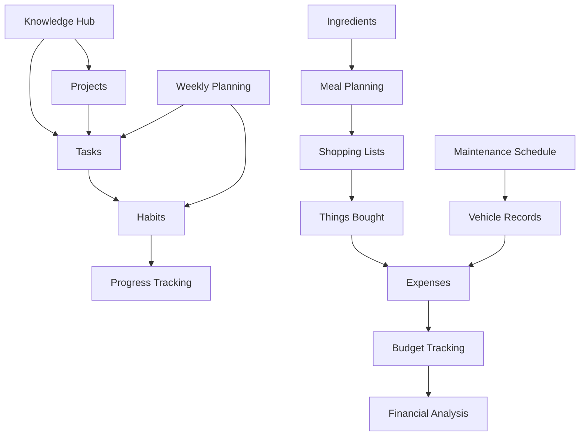

# LifeOS Workflow Mapping & Inter-Database Relationships

**Generated**: June 9, 2025  
**Scope**: 44 Databases, 21 Checkbox Automations, Cross-Database Workflows  
**Purpose**: Define cascade operations and intelligent workflow automation

---

## Executive Summary

This document maps the complex inter-database relationships within the LifeOS workspace and defines intelligent cascade operations that create seamless, automated workflows. The analysis reveals 7 major workflow patterns that connect knowledge management, financial tracking, habit formation, and life management tasks.

---

## 1. Primary Workflow Patterns

### 1.1 Knowledge-to-Action Pipeline

```
Knowledge Hub → Decision Made → Projects → Tasks → Habits → Progress Tracking
     |              |             |        |        |            |
   Research      Finalize      Create    Execute   Track      Analyze
   Collect       Decision      Action    Daily     Progress   Results
   Analyze       Document      Items     Tasks     Metrics    Optimize
```

**Trigger Flow**:
1. **Knowledge Hub**: "Decision Made" checkbox checked
2. **Auto-Creates**: Project entries in project management database
3. **Generates**: Task breakdown with timelines and dependencies  
4. **Initiates**: Habit tracking for consistent execution
5. **Updates**: Progress dashboards and analytics

**Data Flow Mapping**:
```javascript
{
  source: "Knowledge Hub - AI Enhanced",
  trigger: "Decision Made = true",
  cascade_operations: [
    {
      target: "projects_database",
      action: "create_project",
      data_mapping: {
        title: "Implement: {knowledge_hub.title}",
        description: "{knowledge_hub.content_summary}",
        priority: "High",
        deadline: "calculated_from_complexity"
      }
    },
    {
      target: "tasks_database", 
      action: "create_tasks",
      data_mapping: {
        project_id: "{created_project.id}",
        tasks: "extracted_from_decision_content",
        dependencies: "auto_calculated"
      }
    },
    {
      target: "habits_database",
      action: "create_supporting_habits",
      condition: "if_behavioral_change_required",
      data_mapping: {
        habit_name: "derived_from_decision_type",
        frequency: "daily",
        goal: "support_project_success"
      }
    }
  ]
}
```

### 1.2 Financial Management Flow

```
Purchase Decision → Budget Check → Expense Creation → Payment Tracking → Analysis
       |               |             |                |               |
   Things Bought    Validate      Create           Track           Update
   "Buy" = true     Available     Expense          Payment         Budgets
                    Funds         Record           Status          Forecasts
```

**Integration Points**:
- **Budget Validation**: Real-time budget constraint checking
- **Expense Categorization**: Automatic category assignment based on item type
- **Payment Monitoring**: Integration with banking APIs for payment confirmation
- **Trend Analysis**: Spending pattern recognition and optimization suggestions

**Cascade Operation Example**:
```javascript
{
  trigger: "things_bought.Buy = true",
  validation_chain: [
    {
      step: "budget_check",
      condition: "monthly_discretionary >= item_cost",
      block_if_false: true,
      notification: "budget_exceeded_alert"
    }
  ],
  cascade_actions: [
    {
      target: "expenses_database",
      action: "create_expense_forecast",
      data: {
        amount: "{things_bought.estimated_cost}",
        category: "extracted_from_item_type",
        date_expected: "+7_days",
        budget_impact: "calculated"
      }
    },
    {
      target: "recurring_payments",
      action: "check_subscription_overlap",
      condition: "if_service_or_software",
      prevent_duplicates: true
    }
  ]
}
```

### 1.3 Habit-Goal Achievement Loop

```
Goals → Weekly Planning → Daily Habits → Progress Tracking → Goal Updates
  |          |              |              |                |
Define    Prioritize     Execute        Measure          Adjust
Long-term  This Week     Daily Tasks    Completion       Strategies
Objectives Checkboxes    Habit Boxes    Rates           Goals
```

**Automation Flow**:
1. **Goal Definition**: Sets target habits and frequencies
2. **Weekly Planning**: "this week?" checkbox prioritizes supporting tasks
3. **Daily Execution**: Habit checkboxes track daily completion
4. **Progress Analysis**: Automated calculation of completion rates and trends
5. **Goal Adjustment**: AI-suggested modifications based on performance data

### 1.4 Maintenance & Lifecycle Management

```
Scheduled Maintenance → Completion → History Update → Next Schedule → Reminders
        |                  |           |              |             |
    Due Date           "Completed"   Vehicle        Calculate     Set Future
    Reminder           = true        Records        Next Date     Alerts
```

**Predictive Elements**:
- **Maintenance Interval Optimization**: Learn from completion patterns
- **Cost Forecasting**: Predict future maintenance expenses
- **Performance Correlation**: Link maintenance to vehicle performance metrics
- **Vendor Performance Tracking**: Analyze service provider quality over time

### 1.5 Content Curation & Knowledge Building

```
Content Discovery → Evaluation → Curation → Knowledge Integration → Action Generation
       |              |           |            |                    |
   Knowledge Hub    "📁 Pass"   Curated     Knowledge Base      Decision Support
   Content Entry    = true      Collection   Integration         & Planning
```

**Intelligent Processing**:
- **Content Quality Scoring**: AI-based relevance and quality assessment
- **Duplicate Detection**: Prevent redundant content curation
- **Cross-Reference Building**: Link related content across databases
- **Action Item Extraction**: Automatically identify actionable insights

---

## 2. Cross-Database Dependency Mapping

### 2.1 Primary Dependencies



### 2.2 Bidirectional Relationships

#### Knowledge ↔ Habits
- **Forward**: Decisions create supporting habits
- **Reverse**: Habit completion rates inform knowledge priorities

#### Financial ↔ Planning  
- **Forward**: Budget constraints influence planning decisions
- **Reverse**: Planning priorities adjust budget allocations

#### Inventory ↔ Planning
- **Forward**: Available ingredients influence meal planning
- **Reverse**: Planned meals drive shopping and inventory needs

---

## 3. Intelligent Cascade Operations

### 3.1 Smart Decision Propagation

**Scenario**: Knowledge Hub decision marked as complete
```javascript
{
  intelligence_layer: {
    analyze_decision_type: "extract_category_and_complexity",
    identify_stakeholders: "parse_content_for_people_mentions",
    estimate_implementation_time: "ai_complexity_analysis",
    determine_resource_needs: "extract_resource_requirements"
  },
  cascade_logic: {
    if_decision_type: "process_improvement",
    then_create: "habit_tracking_for_new_process",
    
    if_decision_type: "purchase_or_investment", 
    then_create: "budget_allocation_and_tracking",
    
    if_decision_type: "learning_or_skill",
    then_create: "learning_plan_and_progress_tracking"
  }
}
```

### 3.2 Adaptive Budget Management

**Scenario**: Purchase decision triggers budget analysis
```javascript
{
  intelligence_layer: {
    analyze_spending_pattern: "compare_to_historical_spending",
    calculate_opportunity_cost: "evaluate_alternative_uses",
    assess_necessity_score: "ai_need_vs_want_analysis",
    predict_usage_pattern: "based_on_similar_purchases"
  },
  adaptive_response: {
    if_budget_tight: "suggest_alternatives_or_delay",
    if_discretionary_available: "approve_with_tracking",
    if_necessity_high: "adjust_other_budget_categories",
    if_recurring_cost: "evaluate_subscription_overlap"
  }
}
```

### 3.3 Habit Formation Intelligence

**Scenario**: Weekly planning affects habit scheduling
```javascript
{
  intelligence_layer: {
    analyze_weekly_capacity: "calculate_available_time_slots",
    prioritize_habit_importance: "score_based_on_goals",
    predict_completion_likelihood: "based_on_historical_data",
    optimize_habit_timing: "find_best_time_slots"
  },
  adaptive_scheduling: {
    high_priority_weeks: "increase_habit_frequency",
    busy_weeks: "maintain_minimum_viable_habits",
    low_energy_periods: "adjust_difficulty_levels",
    success_streaks: "gradually_increase_challenges"
  }
}
```

---

## 4. Validation Rules & Data Integrity

### 4.1 Cross-Database Validation Rules

#### Financial Consistency
```javascript
{
  validation_rules: [
    {
      rule: "budget_constraint_validation",
      check: "sum(planned_expenses) <= available_budget",
      enforcement: "block_if_violated"
    },
    {
      rule: "payment_reconciliation",
      check: "paid_debts.amount <= account_balance",
      enforcement: "alert_if_insufficient_funds"
    },
    {
      rule: "subscription_overlap_prevention",
      check: "no_duplicate_service_subscriptions",
      enforcement: "suggest_cancellation_of_redundant"
    }
  ]
}
```

#### Temporal Consistency
```javascript
{
  validation_rules: [
    {
      rule: "habit_date_validation",
      check: "habit_completion_date <= current_date",
      enforcement: "prevent_future_logging"
    },
    {
      rule: "maintenance_scheduling",
      check: "next_maintenance_date > completion_date",
      enforcement: "auto_calculate_if_invalid"
    },
    {
      rule: "weekly_planning_bounds",
      check: "this_week_items.date within current_week_range",
      enforcement: "auto_move_to_appropriate_week"
    }
  ]
}
```

### 4.2 Data Quality Enforcement

#### Completeness Checks
- **Required Fields**: Ensure critical information is present before automation triggers
- **Reference Integrity**: Validate cross-database references exist and are valid
- **Business Logic**: Enforce domain-specific rules (e.g., maintenance intervals)

#### Consistency Maintenance  
- **Duplicate Prevention**: Check for duplicate entries across related databases
- **State Synchronization**: Ensure related fields stay synchronized across databases
- **Audit Trails**: Maintain change history for accountability and rollback capability

---

## 5. Performance Optimization Strategies

### 5.1 Efficient Trigger Processing

#### Batch vs Real-time Decision Matrix
```
High Priority (Real-time):
- Financial transactions (payment completion)
- Decision finalization (knowledge hub)
- Habit tracking (daily completion)

Medium Priority (Near real-time, <5 minutes):
- Weekly planning updates
- Maintenance completion
- Purchase decisions

Low Priority (Batch processing, nightly):
- Analytics and reporting
- Trend analysis
- Predictive modeling
```

### 5.2 Caching Strategies

#### Frequently Accessed Data
- **Budget Calculations**: Cache monthly/weekly budget summaries
- **Habit Statistics**: Cache completion rates and streaks
- **Preference Patterns**: Cache learned user preferences and recommendations

#### Database Query Optimization
- **Indexed Fields**: Ensure checkbox fields and dates are properly indexed
- **Query Patterns**: Optimize for common cross-database join operations
- **Connection Pooling**: Manage database connections efficiently

---

## 6. Error Handling & Recovery

### 6.1 Graceful Degradation

#### Partial Automation Success
```javascript
{
  error_handling_strategy: {
    primary_action_fails: "log_error_continue_secondary_actions",
    external_service_unavailable: "queue_for_retry_notify_user",
    validation_failure: "block_action_provide_specific_feedback",
    network_timeout: "retry_with_exponential_backoff"
  }
}
```

### 6.2 Data Recovery Mechanisms

#### Transaction Rollback
- **Atomic Operations**: Ensure multi-database updates are atomic
- **Compensation Actions**: Define rollback procedures for failed cascades
- **State Restoration**: Ability to restore previous state if automation fails

#### Audit and Monitoring
- **Action Logging**: Record all automation triggers and results
- **Performance Monitoring**: Track automation success rates and execution times
- **User Notification**: Alert users to failed automations with clear next steps

---

## 7. Implementation Roadmap

### 7.1 Phase 1: Foundation (Weeks 1-4)
- **Core Checkbox Automations**: Implement single-database triggers
- **Basic Validation Rules**: Ensure data integrity for critical fields
- **Simple Cascade Operations**: Knowledge Hub → Projects, Purchase → Expenses

### 7.2 Phase 2: Integration (Weeks 5-8)
- **Cross-Database Workflows**: Implement complex cascade operations
- **Intelligence Layer**: Add AI-powered decision making to automations
- **Advanced Validation**: Implement business logic and constraint checking

### 7.3 Phase 3: Optimization (Weeks 9-12)
- **Performance Tuning**: Optimize database queries and caching
- **Predictive Features**: Add trend analysis and predictive suggestions
- **User Experience**: Implement smart notifications and dashboard integration

### 7.4 Phase 4: Intelligence (Weeks 13-16)
- **Machine Learning**: Implement pattern recognition and adaptive automation
- **Advanced Analytics**: Build comprehensive reporting and insights
- **Continuous Improvement**: Implement feedback loops and self-optimization

---

## Conclusion

The LifeOS workflow mapping reveals a sophisticated ecosystem where individual checkbox actions trigger intelligent cascade operations across multiple life management domains. The implementation of these workflows will create a truly intelligent personal operating system that anticipates user needs, maintains data consistency, and optimizes for both efficiency and user experience.

The key to success lies in implementing these workflows incrementally, starting with high-value, low-complexity automations and gradually building toward more sophisticated cross-database intelligence. Each phase builds upon the previous, creating a robust foundation for advanced personal productivity automation.